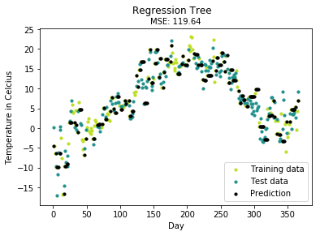
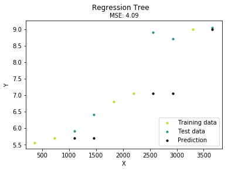

#### 1.部分重要np函数实例，便于理解后面的np调用
当你看不懂部分代码的时候，请结合引用作者的文档
https://www.zhihu.com/people/chen-zhen-64-12/columns


```python
import numpy as np
import pandas as pd
```

np.ones_like测试实例


```python
test = np.array([[1,2,3],[4,5,6]])
test_one = np.ones_like(test)
print(test_one)
print(test_one.sum())
```

    [[1 1 1]
     [1 1 1]]
    6
    

reshape测试实例


```python
K = np.arange(6)
print(K) 
T = K.reshape((3,2))
print(T)
```

    [0 1 2 3 4 5]
    [[0 1]
     [2 3]
     [4 5]]
    

shape测试实例


```python
K = np.arange(6)
print(K)
type(np.shape(K)[0]/2)
```

    [0 1 2 3 4 5]
    


    float


测试数组相减求和


```python
def gain(y,y_pred):
    K = (y - y_pred).sum()
    return K
y = np.array([[1,2],[1,2]])
y_pred = np.array([[2,3],[2,9]])
gain(y,y_pred)
```


    -10


定义一个三元二次方程理解np.power的作用


```python
def funciton_test(x_1,x_2,x_3):
    y = np.power(x_1,2)+3*x_2+x_3
    return y 
funciton_test(2,1,3)
```


    10


测试reshape的用途


```python
z = np.array([[1, 2, 3, 4],
          [5, 6, 7, 8],
          [9, 10, 11, 12],
          [13, 14, 15, 16]])
print('当前的行列数：',z.shape)
A = np.reshape(z,(8,-1))
print('reshape后的行列数：',A.shape)
print(A)
```

    当前的行列数： (4, 4)
    reshape后的行列数： (8, 2)
    [[ 1  2]
     [ 3  4]
     [ 5  6]
     [ 7  8]
     [ 9 10]
     [11 12]
     [13 14]
     [15 16]]
    

#### 2.XGBoost正式代码部分

__future__模块，把下一个新版本的特性导入到当前版本，于是我们就可以在当前版本中测试一些新版本的特性，解决python2中运行pytho3兼容性问题

如果某个版本中出现了某个新的功能特性，而且这个特性和当前版本中使用的不兼容

也就是它在该版本中不是语言标准，那么我如果想要使用的话就需要从future模块导入

division 表示精确除法

progressbar显示完成的进度条


```python
# xgboost算法也将决策树算法作为基函数进行使用
# 导入进度条调度函数，方便展示模型训练进度和倒计时
from utils.decision_tree.decision_tree_model import DecisionTree
from utils.misc import bar_widgets
from __future__ import division, print_function
import progressbar
```


```python
# 最小二乘损失  1/2(x-x_0)^2,看不懂下面的两个函数就请对这个函数进行一阶导数求导和二阶导数求导，其中x_0是常数项
class LeastSquaresLoss():
    """Least squares loss"""
    
    # 定义梯度（最小二乘的一阶导数），参数包括真实值和预测值
    def gradient(self, actual, predicted):
        return actual - predicted

    # 定义海塞函数（最小二乘的二阶导数），参数包括真实值和预测值
    # np.ones_like返回一个用1填充所有元素的同型数组或者同型矩阵，因为最小二乘损失的二阶导数是
    def hess(self, actual, predicted):
        return np.ones_like(actual)
```


```python
# XGBoost回归树，从父类决策树继承，是决策树的子类
# 特别说明一点，GBDT和XGBoost在分类问题上都是先调用回归树，然后通过sigmod函数对输出值做概率转换判断分类
# 有些时候，你会看到以一个下划线开头的实例变量名，比如_name，这样的实例变量外部是可以访问的
# 但按照约定俗成的规定，当你看到这样的变量时，意思是，“虽然我可以被访问，但是，请把我视为私有变量，不要随意访问”。
class XGBoostRegressionTree(DecisionTree):
    """
    Regression tree for XGBoost
    - 参考文档 -
    http://xgboost.readthedocs.io/en/latest/model.html
    """
    
    # y输入是一个矩阵，np.shape是计算矩阵的行数和列数，此处代表返回矩阵的列数的一半用作划分点
    # 此处划分的目的在于将label划分为两部分
    def _split(self, y):
        """ y contains y_true in left half of the middle column and
        y_pred in the right half. Split and return the two matrices """
        col = int(np.shape(y)[1]/2)
        y, y_pred = y[:, :col], y[:, col:]
        return y, y_pred
    
    # 定义打分函数基尼值，此处忽略正则化参数λ
    # 函数计算切分后的数据集的gain值
    def _gain(self, y, y_pred):
        
        # 假设这里的函数是平方误差，那么梯度就是残差，这里的结果就是对矩阵求元素对应位置相减，然后对所有元素求和，最后求平方
        nominator = np.power((self.loss.gradient(y, y_pred)).sum(), 2)
        # 返回一个以y为行列数的对角矩阵，对角线的元素均为1，并求和
        denominator = self.loss.hess(y, y_pred).sum()
        return 0.5 * (nominator / denominator)
    
    # 该函数通过调用gain()来计算树节点的纯度，并以此来作为树是否分割的标准
    # 对输入的三个参数均执行相同的切分操作，切分为两部分
    def _gain_by_taylor(self, y, y1, y2):
        # Split
        y, y_pred = self._split(y)
        y1, y1_pred = self._split(y1)
        y2, y2_pred = self._split(y2)
        
        # 对三个切分好的参数分别计算基尼
        true_gain = self._gain(y1, y1_pred)
        false_gain = self._gain(y2, y2_pred)
        gain = self._gain(y, y_pred)
        return true_gain + false_gain - gain
    
    
    # 此处忽略了正则化参数λ，因此函数名为近似更新
    # xgboost被切割完成后，每个子节点的取值都是定好的了
    # 将approximate_update()作为估算子节点取值的方法
    def _approximate_update(self, y):
        # y split into y, y_pred
        y, y_pred = self._split(y)
        gradient = np.sum(self.loss.gradient(y, y_pred),axis=0)
        hessian = np.sum(self.loss.hess(y, y_pred), axis=0)
        update_approximation =  gradient / hessian
        return update_approximation

    # 将gain_by_taylor()作为切割树的标准
    # 传递回给decisionTree，并以此来构建决策树
    # 很多人会看不懂下面这个super函数，这里看起来是集成了XGBoostRegressionTree本身，实际上不是并不是
    # 需要看到，这里的参数是self，那么我们需要回过去看看XGBoostRegressionTree的self对象是谁
    # XGBoostRegressionTree(DecisionTree)这个类是个子类，大家有没有发现这个子类并没有定义self函数
    # 那是因为，在单层继承中，python定义，子类若不自定义self,那么将直接继承父类的self作为自己的self
    def fit(self, X, y):
        self._impurity_calculation = self._gain_by_taylor
        self._leaf_value_calculation = self._approximate_update
        super(XGBoostRegressionTree, self).fit(X, y)
```


```python
# 定义XGBoost分类树
class XGBoost(object):
    """The XGBoost classifier.

    参考文档: http://xgboost.readthedocs.io/en/latest/model.html

    Parameters:
    -----------
    n_estimators: int
    树的数量
        The number of classification trees that are used.
    learning_rate: float
    梯度下降的学习率
        The step length that will be taken when following the negative gradient during
        training.
    min_samples_split: int
    每棵子树的节点的最小数目（小于后不继续切割）
        The minimum number of samples needed to make a split when building a tree.
    min_impurity: float
    每棵子树的最小纯度（小于后不继续切割）
        The minimum impurity required to split the tree further.
    max_depth: int
    每棵子树的最大层数（大于后不继续切割）
        The maximum depth of a tree.
    """

    def __init__(self, n_estimators=200, learning_rate=0.01, min_samples_split=2,
                 min_impurity=1e-7, max_depth=2):
        self.n_estimators = n_estimators  # 树最大生成数量
        self.learning_rate = learning_rate  # 权重更新步长
        self.min_samples_split = min_samples_split  # 每棵子树的节点的最小数目（小于后不继续切割）
        self.min_impurity = min_impurity  # 每棵子树的最小纯度（小于后不继续切割），标准是最小方差
        self.max_depth = max_depth  # 每棵子树的最大层数（大于后不继续切割）

        self.bar = progressbar.ProgressBar(widgets=bar_widgets)

        # 定义分类的损失为最小二乘损失
        self.loss = LeastSquaresLoss()

        # 初始化回归树
        # for _ in range()表示不关心具体元素内容，就是简单的让下面的循环range()次，_表示占位符
        self.trees = []
        for _ in range(n_estimators):
            tree = XGBoostRegressionTree(
                min_samples_split=self.min_samples_split,
                min_impurity=min_impurity,
                max_depth=self.max_depth,
                loss=self.loss)

            self.trees.append(tree)

            
    # np.concatenate 按轴向将两个数组组成一个新数组
    # 对X计算数据的样本总量
    # 对数据拆分成m行准备用于训练
    def fit(self, X, y):
        # y = to_categorical(y)
        m = X.shape[0]
        y = np.reshape(y, (m, -1))
        # 生成一个全部为0的同时与y相等行列数的数组，该数组主要用于初始化
        # np.concatenate 无法按行对一维度数组拼接，但是对二维及以上的数组可以拼接，按行拼接实际上是对对应元素进行叠加
        y_pred = np.zeros(np.shape(y))
        for i in self.bar(range(self.n_estimators)):
            tree = self.trees[i]
            y_and_pred = np.concatenate((y, y_pred), axis=1)
            tree.fit(X, y_and_pred)
            # 这里是调用了决策树的predict方法，逐个对样本进行分类并返回标签集
            update_pred = tree.predict(X)
            update_pred = np.reshape(update_pred, (m, -1))
            y_pred += update_pred

    def predict(self, X):
        y_pred = None
        m = X.shape[0]
        # 开始预测
        for tree in self.trees:
            # 估计梯度和更新预测值
            update_pred = tree.predict(X)
            update_pred = np.reshape(update_pred, (m, -1))
            if y_pred is None:
                # 初始化一个全部为0的同型数组或者同型矩阵
                y_pred = np.zeros_like(update_pred)
            y_pred += update_pred

        return y_pred
```


```python
# 开始使用实例进行测试，实例数据TempLinkoping2016.txt在GBDT文件夹可以找到
import matplotlib.pyplot as plt
from utils.data_manipulation import train_test_split, standardize, to_categorical, normalize
from utils.data_operation import mean_squared_error, accuracy_score

def main():
    print ("-- XGBoost --")

    # Load temperature data
    data = pd.read_csv('E:\python_data\Machine-Learning-From-Scratch-master\TempLinkoping2016.txt', sep="\t")

    time = np.atleast_2d(data["time"].as_matrix()).T
    temp = np.atleast_2d(data["temp"].as_matrix()).T

    X = time.reshape((-1, 1))               # Time. Fraction of the year [0, 1]
    X = np.insert(X, 0, values=1, axis=1)   # Insert bias term
    y = temp[:, 0]                          # Temperature. Reduce to one-dim

    X_train, X_test, y_train, y_test = train_test_split(X, y, test_size=0.5)
    #print(y_train)
    model = XGBoost()
    model.fit(X_train, y_train)
    y_pred = model.predict(X_test)

    y_pred_line = model.predict(X)
    print(y_test[0:5])
    # Color map
    cmap = plt.get_cmap('viridis')

    mse = mean_squared_error(y_test, y_pred)

    print ("Mean Squared Error:", mse)

    # Plot the results
    m1 = plt.scatter(366 * X_train[:, 1], y_train, color=cmap(0.9), s=10)
    m2 = plt.scatter(366 * X_test[:, 1], y_test, color=cmap(0.5), s=10)
    m3 = plt.scatter(366 * X_test[:, 1], y_pred, color='black', s=10)
    plt.suptitle("Regression Tree")
    plt.title("MSE: %.2f" % mse, fontsize=10)
    plt.xlabel('Day')
    plt.ylabel('Temperature in Celcius')
    plt.legend((m1, m2, m3), ("Training data", "Test data", "Prediction"), loc='lower right')
    plt.show()


    
# 小明.py
# 朋友眼中你是小明(__name__ == '小明'), 你自己眼中你是你自己(__name__ == '__main__')
# 你编程很好, 朋友调你去帮他写程序(import 小明, 这时你在朋友眼中: __name__ == '小明')
# 但你晚上也会打开xx网站, 做一些自己的事情(直接运行小明.py, __name__ == '__main__')
# 也就是说，当你被别的文件导入的时候，你的name并不是__main__,而是导入的模块名称，因此被别人导入的时候，代码不会被执行
if __name__ == "__main__":
    main()
```

    D:\ProgramData\Anaconda3\lib\site-packages\ipykernel_launcher.py:12: FutureWarning: Method .as_matrix will be removed in a future version. Use .values instead.
      if sys.path[0] == '':
    D:\ProgramData\Anaconda3\lib\site-packages\ipykernel_launcher.py:13: FutureWarning: Method .as_matrix will be removed in a future version. Use .values instead.
      del sys.path[0]
    Training:   0% [                                               ] ETA:  --:--:--

    -- XGBoost --
    

    Training: 100% [------------------------------------------------] Time: 0:00:16
    

    [ 5.2 14.5  6.4  6.1  3.7]
    Mean Squared Error: 119.64498937861559
    





```python
data = pd.read_csv('E:\python_data\Machine-Learning-From-Scratch-master\TempLinkoping2016.txt', sep="\t")
```


```python
data.head(3)
```


<div>
<style scoped>
    .dataframe tbody tr th:only-of-type {
        vertical-align: middle;
    }

    .dataframe tbody tr th {
        vertical-align: top;
    }

    .dataframe thead th {
        text-align: right;
    }
</style>
<table border="1" class="dataframe">
  <thead>
    <tr style="text-align: right;">
      <th></th>
      <th>time</th>
      <th>temp</th>
    </tr>
  </thead>
  <tbody>
    <tr>
      <th>0</th>
      <td>0.002732</td>
      <td>0.1</td>
    </tr>
    <tr>
      <th>1</th>
      <td>0.005464</td>
      <td>-4.5</td>
    </tr>
    <tr>
      <th>2</th>
      <td>0.008197</td>
      <td>-6.3</td>
    </tr>
  </tbody>
</table>
</div>


```python
import matplotlib.pyplot as plt

from utils.data_manipulation import train_test_split, standardize, to_categorical, normalize
from utils.data_operation import mean_squared_error, accuracy_score

def main():
    print ("-- XGBoost --")

    # Load temperature data
    x = np.array(range(1,11,1))
    y = np.array([5.56,5.70,5.91,6.40,6.80,7.05,8.9,8.7,9.00,9.05])
    data = pd.DataFrame([x,y]).T
    data.columns=['x','y']

    time = np.atleast_2d(data["x"].as_matrix()).T
    temp = np.atleast_2d(data["y"].as_matrix()).T

    X = time.reshape((-1, 1))               # Time. Fraction of the year [0, 1]
    X = np.insert(X, 0, values=1, axis=1)   # Insert bias term
    y = temp[:, 0]                          # Temperature. Reduce to one-dim

    X_train, X_test, y_train, y_test = train_test_split(X, y, test_size=0.5)
    #print(y_train)
    model = XGBoost()
    model.fit(X_train, y_train)
    y_pred = model.predict(X_test)

    y_pred_line = model.predict(X)
    print(y_test[0:5])
    # Color map
    cmap = plt.get_cmap('viridis')

    mse = mean_squared_error(y_test, y_pred)

    print ("Mean Squared Error:", mse)

    # Plot the results
    m1 = plt.scatter(366 * X_train[:, 1], y_train, color=cmap(0.9), s=10)
    m2 = plt.scatter(366 * X_test[:, 1], y_test, color=cmap(0.5), s=10)
    m3 = plt.scatter(366 * X_test[:, 1], y_pred, color='black', s=10)
    plt.suptitle("Regression Tree")
    plt.title("MSE: %.2f" % mse, fontsize=10)
    plt.xlabel('X')
    plt.ylabel('Y')
    plt.legend((m1, m2, m3), ("Training data", "Test data", "Prediction"), loc='lower right')
    plt.show()


if __name__ == "__main__":
    main()
```

    D:\ProgramData\Anaconda3\lib\site-packages\ipykernel_launcher.py:15: FutureWarning: Method .as_matrix will be removed in a future version. Use .values instead.
      from ipykernel import kernelapp as app
    D:\ProgramData\Anaconda3\lib\site-packages\ipykernel_launcher.py:16: FutureWarning: Method .as_matrix will be removed in a future version. Use .values instead.
      app.launch_new_instance()
    Training:  91% [-------------------------------------------     ] ETA:  0:00:00

    -- XGBoost --
    

    Training: 100% [------------------------------------------------] Time: 0:00:00
    

    [5.91 8.7  6.4  8.9  9.05]
    Mean Squared Error: 4.08552
    





```python
print('\n'.join([''.join([('36.5'[(x-y) % len('36.5')] if 
                           ((x*0.05)**2+(y*0.1)**2-1)**3-(x*0.05)**2*(y*0.1)**3 <= 0 else ' ') 
                          for x in range(-30, 30)]) for y in range(30, -30, -1)]))
```

                                                                
                                                                
                                                                
                                                                
                                                                
                                                                
                                                                
                                                                
                                                                
                                                                
                                                                
                                                                
                                                                
                                                                
                                                                
                                                                
                                                                
                                                                
                    .536.536.           .536.536.               
                536.536.536.536.5   536.536.536.536.5           
              .536.536.536.536.536.536.536.536.536.536.         
             .536.536.536.536.536.536.536.536.536.536.53        
            .536.536.536.536.536.536.536.536.536.536.536.       
            536.536.536.536.536.536.536.536.536.536.536.5       
            36.536.536.536.536.536.536.536.536.536.536.53       
            6.536.536.536.536.536.536.536.536.536.536.536       
            .536.536.536.536.536.536.536.536.536.536.536.       
            536.536.536.536.536.536.536.536.536.536.536.5       
             6.536.536.536.536.536.536.536.536.536.536.5        
              536.536.536.536.536.536.536.536.536.536.5         
              36.536.536.536.536.536.536.536.536.536.53         
                536.536.536.536.536.536.536.536.536.5           
                 6.536.536.536.536.536.536.536.536.5            
                  536.536.536.536.536.536.536.536.5             
                    .536.536.536.536.536.536.536.               
                      6.536.536.536.536.536.536                 
                        36.536.536.536.536.53                   
                           36.536.536.536.                      
                              36.536.53                         
                                 36.                            
                                  .                             
                                                                
                                                                
                                                                
                                                                
                                                                
                                                                
                                                                
                                                                
                                                                
                                                                
                                                                
                                                                
                                                                
                                                                
                                                                
                                                                
                                                                
                                                                
                                                                
    


```python

```
